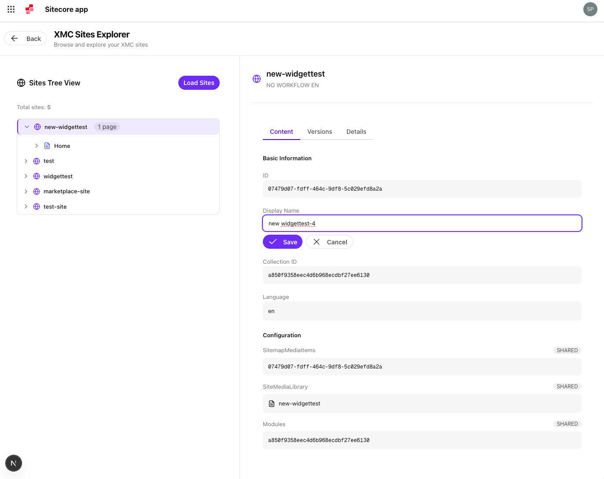

# Use case: Sites- and Pagelist (Spyros)

This use case allows even those **new to Sitecore** to experience how extensions can read and write  data using the Marketplace SDK within the Cloud Portal, showcasing Vibe Coding with Blok MCP for rapid, interactive development. Using the **Standalone Extension Point**, attendees will build an extension that lists Sites and Pages retrieved using the **Marketplace SDK**. 



[Reference Repository](https://github.com/Sitecore/hackerspace-workshop/app/page-list)

Extension Point: **Standalone**

## Summary TODO

In this use case, participants build a **Sites and Pages Listing App** as an XM Cloud Extension using the **Standalone** Extension Point in the Sitecore Cloud Portal. The app allows users to browse all Sites and Pages in a hierarchical tree view, view details, and edit content fields directly from the interface. It demonstrates how to integrate with Sitecore data via the Marketplace and extend developer workflows using Vibe Coding with Blok MCP for a streamlined, interactive development experience.

## Implementation Steps
[TODO]
Example:

1. Check app config in developer studio
2. Create the sites list component
3. Create a new Sites listing page
4. Add first level pages to the sites tree view
5. Make display name editable
6. Go recursive to deeper levels of pages
7. Create the Split screen design

### Step 1. Check App Config
Revisit the Developer Studio to check if you have chosen the right extension point for this app. 

### Step 2. Create Sites list Component
Introduction: Why are we doing this step
- Create new Component that loads all existing sites similar to the existing components

1. Create file `list-sites.tsx` in [TODO: Path in components folder or in app/pagelist/components?]


2. **Prompt:** 
```
Using the example of @list-languages.tsx I want to create another component inside of @list-sites.tsx that is fetching and listing all xmc sites, using marketplace sdk. Create the component and add it in @/app/page.tsx
```

3. Review the code and the results in the app

### Step 3. Components.json register blok mcp - is that needed?
some text here

### Step 3. New Sites Listing Page
1. **Prompt:** 
```
Let's create a new page where we only list sites in a tree structure. use @blok registry with shadcn mcp to generate the UI.
```
2. Test: Go to the newly created sites tree page.

### Step 4. Add Pages to the tree list
1. **Prompt:** 
  ```
  Now, let's pull in all pages for each site and render it as part of the collapsible. Use marketplace with xmc.xmapp module.
  ```
2. Test: Refresh the page and validate the results.


### Step 5. make display name editable
1. **Prompt:** 
```
Take a look at @sites-tree.tsx and @list-sites.tsx to understand how marketplace sdk works and what we have already achieved so far. We want to create a new feature to "inline update a sites display name". you may search node modules for marketplace sdk types to understand how we can achieve this.
```

2. Test: Refresh the page and validate if you can now change the site and page display names.


### Step 6. Make the Explorer page the starting point and redesign
1. **Prompt:**
```
 I want us to adapt our UI inside Sites Explorer page. You may access @Browser , it's already in the correct page, dont redirect, to get a snapshot of the UI. The purpose is to make it look closer to XMCloud explorer app. attaching a screenshot for reference. The difference is that XMC explorer app is expanding tree on the right, we want to keep the existing tree view. In the right half of the page, we need to introduce a details panel, similar in context to the screenshot. you may use blok shadcn registry to add components if needed. you may ask questions for clarification. 
```
Use this image:


### 7. Cleanup

1. **Prompt**
```
let's focus on what is available from the screenshot for our first goal. tabs is needed, we'll explore their functionality later. clicking on an item shoud both expand and show it's details. layout 40/60 for now and we'll see. aim is start simple with something to work with, then expand
```

2. **Prompt**
```
remove publish button from the right side, we don't support this functionality.
```

We should also move the info runder site and page to the right side, including the update display name funtionality.

3. **Prompt**
```
remove all reset buttons. also, sharing a screenshot from deails tab, have a look what you can display
```

4. **Prompt**
```
take a screenshot from active broswer window, right side tabs should take full available width as the underline. also remove separator line above. also, "no workflow" and "en" should be badges
```

5. **Prompt**
```
the tree part needs a fix, wierd UX:

when user clicks on arrow, it expads, no focus. when user clicks on the whole items apart from the arrow area, it focuses the item in the right panel
```
6. **Prompt**
```
now, make the following updates:

- make the sites tree the main page
- remove back button from top of the page
- load sites on page load, remove "load sites" button
```


## Resources
Essential links for AI-powered Sitecore marketplace development:

- [Workshop Setup Guide](index.md) - Complete preparation steps
- [Sitecore Marketplace SDK Documentation](https://doc.sitecore.com/mp/en/developers/sdk/latest/sitecore-marketplace-sdk/)
- [Blok Shadcn Registry](https://blok-shadcn.vercel.app/) - UI components for rapid development
- [Sitecore MCP Documentation](https://doc.sitecore.com/mcp) - AI assistance integration
- [Hugging Face Inference API](https://huggingface.co/docs/api-inference/index)
- [Next.js App Router Documentation](https://nextjs.org/docs/app)
- [Sitecore Marketplace Developer Portal](https://developers.sitecore.com/marketplace)
